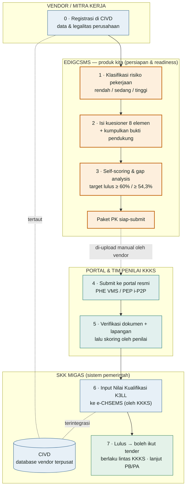
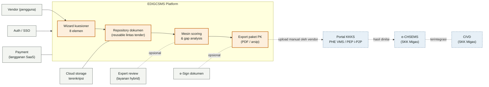
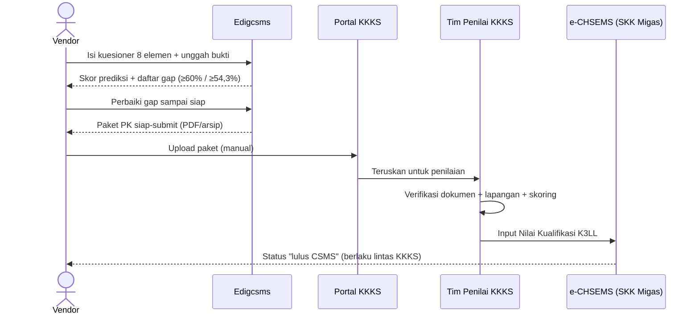

# Edigcsms — Bagan Alir & Keterhubungan Sistem

> Dokumen kerja untuk validasi ke konsultan CSMS/e-CHSEMS.
> Acuan: **PTK 005 / kriteria e-CHSEMS SKK Migas**. Angka ambang & detail portal perlu dikonfirmasi ke edisi terbaru.

---

## 1. Bagan alir end-to-end (siapa mengerjakan apa)

Aliran dari pendaftaran vendor sampai status "lulus CSMS". Warna lane menandai pemilik proses.
Zona **Edigcsms** = bagian persiapan yang selama ini dibebankan ke konsultan berbayar.

**Titik kunci:** Edigcsms berhenti tepat di **"Paket PK siap-submit"**. Penyerahan ke portal KKKS dilakukan **manual oleh vendor** — tidak ada koneksi otomatis ke sistem pemerintah.

---

## 2. Keterhubungan sistem — di mana Edigcsms menempel

Garis **tegas** = integrasi nyata yang bisa kita bangun.
Garis **putus-putus** = serah-terima manual / tidak ada API publik (sistem pemerintah).

### Ringkasan keterhubungan

| Sistem | Hubungan dengan Edigcsms | Jenis |
|--------|--------------------------|-------|
| **CIVD** (SKK Migas) | Tidak terhubung langsung — vendor daftar sendiri | ❌ Tidak ada API |
| **Portal KKKS** (PHE VMS / PEP i-P2P) | Tujuan akhir paket — vendor upload manual | ⚠️ Serah-terima manual |
| **e-CHSEMS** (SKK Migas) | Hanya menerima nilai dari KKKS | ❌ Tidak ada API |
| **Auth / SSO** | Login & manajemen akun vendor | ✅ Integrasi internal |
| **Cloud storage terenkripsi** | Simpan bukti dokumen (data sensitif) | ✅ Integrasi internal |
| **Payment** | Langganan SaaS | ✅ Integrasi pihak ketiga |
| **e-Sign** (opsional) | Tanda tangan dokumen kebijakan | ✅ Integrasi pihak ketiga |
| **Expert review** (opsional) | Layanan hybrid berbayar | ✅ Modul internal |

---

## 3. Urutan interaksi (sequence)

---

## Catatan kepatuhan & keamanan

- **Batas produk:** Edigcsms = layer *persiapan/readiness*. Bukan penerbit sertifikat, bukan pengganti portal resmi/penilai KKKS.
- **Tidak overclaim:** output = *kesiapan*, bukan jaminan lulus.
- **Keamanan data (OWASP):** dokumen vendor sangat sensitif (legalitas, data personel) → enkripsi at-rest & in-transit, kontrol akses berbasis peran, audit log. Wajib jadi prioritas sejak desain.
